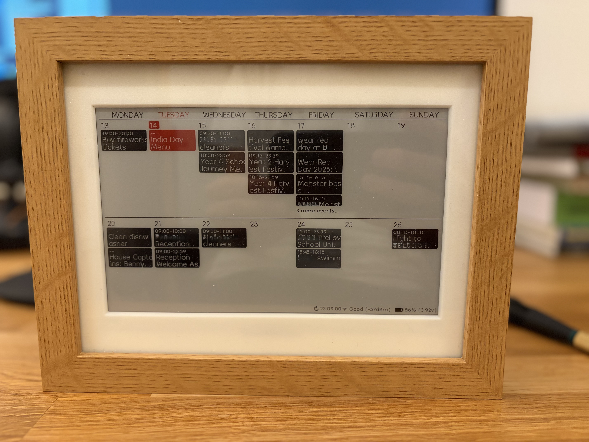

# ESP32 E-Ink Calendar Display

A calendar display using an ESP32 and a 7.5" e-ink display that fetches events from Home Assistant and shows them in a beautiful two-week calendar view.



## Features
- **Home Assistant integration** - Fetches calendar events via API
- **Two-week calendar view** with current day highlighting
- **Smart event display** with overflow handling and multi-day event support
- **Multiple calendar support** (family, work, school calendars)
- **Battery monitoring** with power management
- **Deep sleep mode** for extended battery life

## Hardware Requirements
The hardware setup pretty much follows [esp32-weather-epd](https://github.com/lmarzen/esp32-weather-epd). Refer to the project for wiring. I used
- **ESP32 Board**: DFRobot FireBeetle 2 ESP32-E
- **Display**: GoodDisplay 7.5" 3-color e-ink (GDEY075Z08) - 800x480 pixels
- **Adapter Board**: DESPI-C02
- **Battery**: 3.7V 3000 mAh 11.1Wh 505573 Polymer Lithium Battery - [Link](https://www.aliexpress.com/item/1005004774876351.html?spm=a2g0o.order_list.order_list_main.10.27761802vFOR0s)

For the case I printed [Kingfisher's Weather Station E-Ink Frame](https://www.printables.com/model/1139047-weather-station-e-ink-frame) but also used[ Katherine Dubé's](https://www.printables.com/model/1276878-weather-station-e-ink-frame-back-panel-and-front-b) back panel.


## Quick Start

### 1. Clone Repository

```bash
git clone https://github.com/YOUR_USERNAME/esp32-eink-calendar.git
cd esp32-eink-calendar
```

### 2. Configure Credentials

```bash
cp src/config.h.template src/config.h
```

Edit `src/config.h` with your credentials:

```cpp
#define WIFI_SSID "YourWiFiName"
#define WIFI_PASSWORD "YourWiFiPassword"
#define HA_SERVER "http://your-homeassistant:8123/api/states/sensor.esp32_calendar_data"
#define HA_TOKEN "your_home_assistant_long_lived_access_token"
```

### 3. Build and Upload

```bash
# Using PlatformIO
pio run -t upload -t monitor
```

## Home Assistant Setup

### 1. Create Long-Lived Access Token

1. Go to Home Assistant → Profile → Long-Lived Access Tokens
2. Create new token and copy it to your `config.h`

### 2. Configure Calendar Template Sensor

I created a template sensor in Home Assistant which uses calendar events imported from the Google Calendar Integration. The sensor updates once a minute. The template merges events for two calendars. Adjust this as required

Add this to your Home Assistant `configuration.yaml`:

```yaml
template:
  # templated sensor combining the calendar events of two calendars into one json response
  # used by the ESP32 calendar screen to fetch the events
  - triggers:
      - trigger: time_pattern
        hours: "*"
        minutes: "*"
    actions:
      - action: calendar.get_events
        target:
          entity_id:
            - calendar.<calendar_name_1>
            - calendar.<calendar_name_2>
        data:
          duration:
            days: 14
          start_date_time: >
            
            
            {{ (today - timedelta(days=days_since_monday)).isoformat() }}T00:00:00+01:00
        response_variable: agenda
    sensor:
      - name: "ESP32 Calendar Data"
        state: >
          {{ agenda['calendar.<calendar_name_1>'].events | length + agenda['calendar.<calendar_name_2>'].events | length }}
        attributes:
          events: >
            
            
              
              
                {%- set start_date = strptime(event.start, '%Y-%m-%d').date() -%}
                {%- set end_date = strptime(event.end, '%Y-%m-%d').date() -%}
                
                  
                
              
              
            
            
              
              
                {%- set start_date = strptime(event.start, '%Y-%m-%d').date() -%}
                {%- set end_date = strptime(event.end, '%Y-%m-%d').date() -%}
                
                  
                
              
              
            
            {{ ns.events }}
          current_date: "{{ now().strftime('%Y-%m-%d') }}"
          current_day: "{{ now().strftime('%A') }}"
          current_time: "{{ now().strftime('%H:%M:%S') }}"
          week_start: >
            
            
            {{ (today - timedelta(days=days_since_monday)).isoformat() }}
          period: >
            
            
            
            
            {{ monday_this_week.isoformat() + " to " + end_next_week.isoformat() }}
```

### 3. Restart Home Assistant

Restart Home Assistant to load the new sensor.

## Development
This project has been developed using Claude Code. The reasons for this are that 1) I wanted to gain more experience with vibe coding and 2) I would have not been able to write the project in the little time available without the help of an LLM.

As a result of using Claude Code, ehe code has quite some potential for refinment and refactoring. There are things I would have done differently would this be production code. But then again, it works as is ;) 

## License

This project is licensed under the Creative Commons Attribution-NonCommercial-ShareAlike 4.0 International License - see the [LICENSE](LICENSE) file for details.

**Non-Commercial Use Only**: This project may not be used for commercial purposes.

## Acknowledgments

- [esp32-weather-epd](https://github.com/lmarzen/esp32-weather-epd) for hardware setup, wifi, deep sleep and battery monitoring
